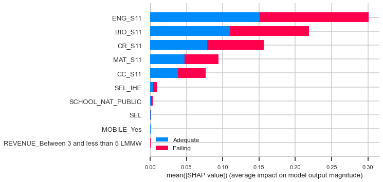
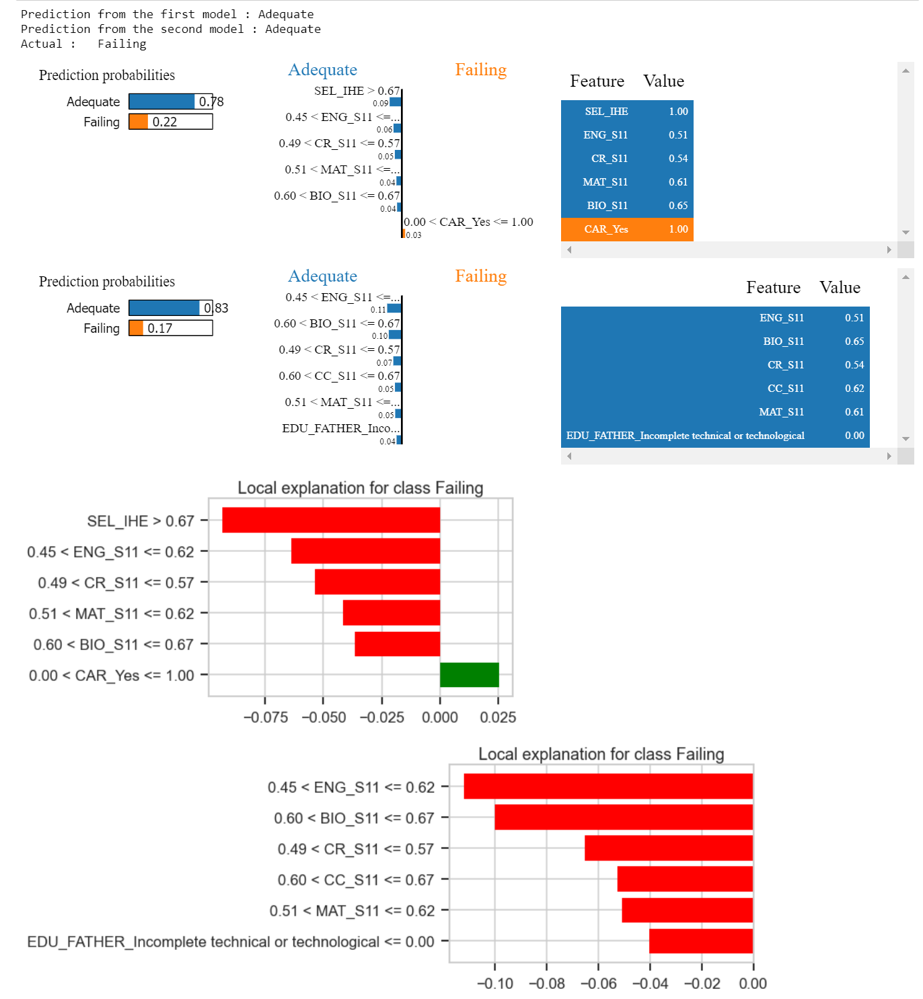

<center><b><font size="6">Modeling Engineering Student Performance</font></b></center>

<span style="color:red; font-size:1.5em">**Phase 3 Final Project**</span><br>
* Student name: <b>Elena Kazakova</b>
* Student pace: <b>full time</b>
* Cohort: <b>DS02222021</b>
* Scheduled project review date/time: <span style="color:red"><b>TBD</b></span>
* Instructor name: <b>James Irving</b>
* Blog post URL: <span style="color:red"><b>TBD</b></span>

# Table of Contents 

*Click to jump to matching Markdown Header.*<br>

- **[Introduction](#INTRODUCTION)<br>**
- **[Obtain](#Obtain)**<br>
- **[Scrub](#Scrub)**<br>
- **[Explore](#Explore)**<br>
- **[Model](#Model)**<br>
- **[iNterpret](#iNterpret)**<br>
- **[Conclusions/Recommendations](#Conclusions-and-Recommendation)<br>**
___

# Introduction

## Business Problem
This project aims to build a predictive classification model of graduating Colombian Engineering students' performance evolution based on their students' socio-economic characteristics and engineering programs they attended.

This information can be helpful for university officials to identify students not fulfilling their potential and providing additional support (financial, etc.) to help them progress in their professional careers. The results of the model also can assist future engineering students in choosing professional programs and universities.

# Obtain

## Importing Python tools and utilities


```python
import pandas as pd
import numpy as np
import matplotlib.pyplot as plt
import seaborn as sns
import math
import scipy.stats as stats
import graphviz
import pylab
import joblib
import shap
import lime
import random
from PIL import Image
import os
from IPython.display import HTML

from lime import lime_tabular
from lime import submodular_pick
from yellowbrick.features import Rank2D
from yellowbrick.classifier import ClassificationReport
from matplotlib import style
from graphviz import Source

from sklearn import metrics
from sklearn import set_config
from sklearn import tree

from sklearn.feature_selection import VarianceThreshold
from sklearn.impute import SimpleImputer
from sklearn.dummy import DummyClassifier
from sklearn.linear_model import LogisticRegression, LogisticRegressionCV
from sklearn.tree import DecisionTreeClassifier 
from sklearn.preprocessing import OneHotEncoder, StandardScaler, MinMaxScaler
from sklearn.neighbors import KNeighborsClassifier
from sklearn.ensemble import BaggingClassifier, RandomForestClassifier, StackingClassifier

from sklearn.inspection import permutation_importance
from xgboost import XGBRFClassifier,XGBClassifier
from xgboost import plot_importance
from sklearn.model_selection import permutation_test_score
from sklearn.model_selection import StratifiedKFold
from sklearn.pipeline import Pipeline, make_pipeline
from sklearn.compose import ColumnTransformer, make_column_transformer


from sklearn.model_selection import train_test_split
from sklearn.model_selection import cross_val_score
from sklearn.model_selection import GridSearchCV

from sklearn.metrics import confusion_matrix, plot_confusion_matrix,\
    precision_score, recall_score, accuracy_score, f1_score, log_loss,\
    roc_curve, roc_auc_score, classification_report,plot_roc_curve

from dtreeviz.trees import dtreeviz
from IPython.display import display, Math, Latex
from plotly.subplots import make_subplots


from warnings import filterwarnings
filterwarnings('ignore')

from cf_matrix import make_confusion_matrix

%matplotlib inline
```

## Functions used


```python

def distribution(column):
    """This is a snippet from https://atmamani.github.io/cheatsheets/seaborn/seaborn_cheat_sheet_1/
    
    Takes in a column of a dataframe and generates a distribution plot of the values in this column
    along with a title that shows mean, standard deviation, skewness and kurtosis.
    No returned values."""
    col_mean = column.mean()
    col_sd = column.std()
    skew_val = stats.skew(column, bias=False)
    kurt_val = stats.kurtosis(column,bias=False)
    
    ax = sns.distplot(column, kde_kws={"color": "r", "lw": 2, "label": "KDE", "bw_adjust": 3})
        
    ax.axvline(x=col_mean, color='black', linestyle='dashed')

    ax.axvline(x=col_mean + col_sd, color='red', linestyle='dotted')
    ax.axvline(x=col_mean - col_sd, color='red', linestyle='dotted')

    ax.set_title('$\mu = {}$ | $\sigma = {}$ | Skew = {} | Kurtosis = {}'.
                 format(round(col_mean, 2), round(col_sd, 2), round(skew_val,2), round(kurt_val,2)))
    
    plt.subplots_adjust(top=0.5)
    plt.tight_layout()
    
    
def creating_failing(df, column):
    """A function that creates a new 'FAILING' column in both the training dataframe with target values and 
    a df (test target values) dataframe. The function also assigns binary values to this colum in both dataframes
    based on mean value in the training dataframe. 0.0 is assigned to the records that have original values equal
    or more than the mean and 1.0 that are below the mean
    **************************
    Arguments:
    df: test target values dataframe
    column: a source column """
    
# Identifying a mean of G_SC values for the training set
    mean_=y_train[column].mean()
    
# Creating a new binary column
    y_train['FAILING'] = [0 if x >= mean_ else 1 for x in (y_train[column])]
    df['FAILING'] = [0 if x >= mean_ else 1 for x in (df[column])]
    
    y_train_final=y_train.drop([column], axis=1)
    df_final=df.drop([column], axis=1)

    return y_train_final, df_final

    
def  conf_matrix_pretty(model, X, y, title):
    """This is a function taken from https://github.com/DTrimarchi10/confusion_matrix.
    the code is in cf_matrix.py.
    **************************
    Arguments:
    model: a model to evaluate
    X: a features dataframe
    y: a target dataframe
    the title over a confusion matrix"""
        
    sns.set_context('talk')
    cm=confusion_matrix(y, model.predict(X))
    
    labels = ['TN','FP','FN','TP']
    categories = ['Adequate (0)', 'Failing (1)']
    make_confusion_matrix(cm, group_names=labels, categories=categories, cmap='Reds', title=title, figsize=(8,6))
    
    
def simple_model_validation(model, set_list, title1, title2):
    """A function generating confusion matrices (train/test) with model metrics and roc curves
    *******************
    Arguments:
    model: a model to evaluate
    set_list: a list of dataframe names [X_train, X_test, y_train, y_test]
    titel1: a title for the training set confusion matrix
    title2: a title for the test set confusion matrix"""
    
    X_train=set_list[0]
    X_test=set_list[1]
    y_train=set_list[2]
    y_test=set_list[3]
    
    y_pred1 = model.predict(X_train)
    y_pred2 = model.predict(X_test)
    
    print('***************************************')
    print(model)
    print('***************************************\n')
    
    
    print('Classification Report for training set')
    print('***************************************')
    print(metrics.classification_report(y_train, y_pred1)+'\n')
    print('Classification Report for test set')
    print('***************************************')
    print(metrics.classification_report(y_test, y_pred2)+'\n')
    
    print('***************************************')
    diff_acc=round(metrics.accuracy_score(y_pred1, y_train)-metrics.accuracy_score(y_pred2, y_test), 3)
    diff_recall=round(metrics.recall_score(y_pred1, y_train)-metrics.recall_score(y_pred2, y_test), 3)
    
    print('Differences in Accuracy scores between training and test sets: {}'.
          format(diff_acc))
    print('Differences in Recall scores between training and test sets: {}\n'.
          format(diff_recall))
    
    conf_matrix_pretty(model, X_train, y_train, title1)
    conf_matrix_pretty(model, X_test, y_test, title2)
    
    fig,ax = plt.subplots(ncols=2,figsize=(15,7))
    
    roc_curve1=plot_roc_curve(model, X_train, y_train, ax=ax[0])
    
    roc_curve1.ax_.plot([0,1],[0,1],ls=':')
    
    roc_curve2=plot_roc_curve(model, X_test, y_test, ax=ax[1])
    ax[0].set_title('Training set ROC')
    ax[1].set_title('Test set ROC')
    
    roc_curve2.ax_.plot([0,1],[0,1],ls=':')
    
    return
    

def get_importance_logreg_no_plot(model, X):
    """This function is to display feature importances in a regression model, the importance 
    is calculated manually for each coefficient. The returned variable is a dataframe with Feature names, 
    an importance of the features and a coefficient associated with that feature
    *******************
    Arguments:
    model: a model to evaluate
    X: a dataframe
    """
    
    feature_names = X.columns
    w0 = model.intercept_[0]
    w = model.coef_[0]
    
    pd.set_option('display.width', 1000)
    feature_importance = pd.DataFrame(feature_names, columns = ['Feature'])
    feature_importance['Importance'] = pow(math.e, abs(w))
    feature_importance['Coefficient'] = w
    feature_importance = feature_importance.sort_values(by = ["Importance"], ascending=True)
 
    return feature_importance

def get_importance_logreg(model, X, top_n=30, figsize=(15,15)):
    """Function returns a dataframe with feature importance values and the corresponding coefficient
    in the regression based lodel.It also plots a bar plot of feature importance.
    **************************
    Arguments:
    model: model
    X: a dataframe with the names of the features
    top_n: a number of features to display on a plot (default is 20)
    figure: a tuple with a figure size (default is (15,15))"""
    
    feature_names = X.columns
    w0 = model.intercept_[0]
    w = model.coef_[0]
    
    pd.set_option('display.width', 1000)
    feature_importance = pd.DataFrame(feature_names, columns = ['Feature'])
    feature_importance['Importance'] = pow(math.e, abs(w))
    feature_importance['Coefficient'] = w
    feature_importance = feature_importance.sort_values(by = ["Importance"], ascending=True).tail(top_n)
 

    ax = feature_importance.plot.barh(x='Feature', y='Importance', figsize=figsize, title='Feature Importance',
                                     ylabel='Feature')
    plt.show()
    return feature_importance

def get_importance_tree(model, X, top_n=30, figsize=(10,10), plot=True):
    """Function returns a dataframe with feature importance values and the corresponding coefficient
    in the decisiontree based model. It also plots a bar plot of feature importance.
    **************************
    Arguments:
    model: model
    X: a dataframe with the names of the features
    top_n: a number of features to display on a plot (default is 20)
    figure: a tuple with a figure size (default is (15,15))"""
    
    df_importance = pd.Series(model.feature_importances_, index=X.columns)
    
    if plot:
        df_importance.sort_values(ascending=True).tail(top_n).plot(kind='barh',
                                                               figsize=figsize, title='Feature Importances',
                                                               ylabel='Feature')
    else:
        df_importance.sort_values(ascending=True).tail(top_n)
        
    return df_importance


def adding_to_models_dict(dict_, descr, classifier_name, set_list, model, joblib_file):
    """A function to build a dictionary with all built and evaluated models metrics and information for easy comparison.
    ***************
    Arguments
    dict_: dictionary name
    descr: description of the model ('str')
    classifier_name: the name of the classifier ('str')
    set_list: a list of dataframe names [X_train, X_test, y_train, y_test]
    model: model to add (classifier)
    joblib_file: the name of the file with the saved model ('str')
    """
    X_train=set_list[0]
    X_test=set_list[1]
    y_train=set_list[2]
    y_test=set_list[3]
    
    y_pred1 = model.predict(X_train)
    y_pred2 = model.predict(X_test)
    
    acc_score_train=round(metrics.accuracy_score(y_pred1, y_train),3)
    acc_score_test=round(metrics.accuracy_score(y_pred2, y_test),3)
    
    cm_train=confusion_matrix(y_train, model.predict(X_train))
    cm_test=confusion_matrix(y_test, model.predict(X_test))
    
    recall_score_train=round(cm_train[1][1]/(cm_train[1,1]+cm_train[1][0]),3)
    recall_score_test=round(cm_test[1][1]/(cm_test[1,1]+cm_test[1][0]),3)
    FN_train=cm_train[1][0]
    FN_test=cm_test[1][0]
    
    total_records_train=X_train.shape[0]
    total_records_test=X_test.shape[0]
    
    dict_['Classifier Name'].append(classifier_name)
    dict_['Description'].append(descr)
    dict_['Training or Test'].append('training')
    dict_['Accuracy'].append(acc_score_train)
    dict_['Recall'].append(recall_score_train)
    dict_['FN'].append(FN_train)
    dict_['Total number of records'].append(total_records_train)
    dict_['Saved model'].append(joblib_file)
    
    dict_['Classifier Name'].append(classifier_name)
    dict_['Description'].append(descr)
    dict_['Training or Test'].append('test')
    dict_['Accuracy'].append(acc_score_test)
    dict_['Recall'].append(recall_score_test)
    dict_['FN'].append(FN_test)
    dict_['Total number of records'].append(total_records_test)
    dict_['Saved model'].append(joblib_file)
    
    return dict_


def permutation_of_features_logreg(model, X_train, X_test, y_test):
    """Function returns a dataframe with permutations importance per feature
    along the feature name and the feature importance for a regression model
    **************
    Arguments
    model: logistic regression model
    X_train: training dataset (df)
    X_test: test dataset (df)
    y_test: target values for the test dataset (df)"""
    
    r_model = permutation_importance(model, X_test, y_test,
                           n_repeats=50, scoring='recall', random_state=123)

    model_perm_importances = pd.Series(r_model['importances_mean'],index=X_train.columns,
                           name = 'Permutation Importance')

    df_perm_model=pd.DataFrame(model_perm_importances)


    df_imp_model=pd.DataFrame(get_importance_logreg_no_plot(model, X_test))
    df_imp_model=df_imp_model.set_index('Feature')
    df_imp_model=df_imp_model.rename(columns={'Importance': 'Feature Importance'})


    model_perm_vs_imp=pd.concat([df_imp_model, df_perm_model], axis=1)

    return model_perm_vs_imp.sort_values('Feature Importance', ascending=False).head(15)


def permutation_of_features_tree(model, X_train, X_test, y_test):
    """Function returns a dataframe with permutations importance per feature
    along the feature name and the feature importance for a decisiontree model
    **************
    Arguments
    model: logistic regression model
    X_train: training dataset (df)
    X_test: test dataset (df)
    y_test: target values for the test dataset (df)"""
    
    r_model = permutation_importance(model, X_test, y_test,
                           n_repeats=50, scoring='recall', random_state=123)

    model_perm_importances = pd.Series(r_model['importances_mean'],index=X_train.columns,
                           name = 'Permutation Importance')

    df_perm_model=pd.DataFrame(model_perm_importances)


    df_imp_model=pd.DataFrame(get_importance_tree(model, X_test, top_n=50, plot=False))
    df_imp_model=df_imp_model.rename(columns={0: 'Feature_Importance'})


    model_perm_vs_imp=pd.concat([df_imp_model, df_perm_model], axis=1)
    print('Feature Importanve vs Permutation importance for {} model'.format(model))
    return model_perm_vs_imp.sort_values('Feature_Importance', ascending=False).head(15)


def ABS_SHAP(df_shap, df, n=20, figure=(20,20)):
    """The code is taken from https://towardsdatascience.com/explain-your-model-with-the-shap-values-bc36aac4de3d
    
    Some minor modifications: adjusting figure size and limiting the number of bars to an argument
    output to 10 feature with the highest shapley values. Also added a figuresize as an argument.
    **********************
    Arguments:
    df_shap: shapley values
    df: dataframe to analize (test, train)
    n: number of features to include in the diagram (default=20)
    figure: figure size, default is (20,20)"""
    
    # Make a copy of the input data
    shap_v = pd.DataFrame(df_shap)
    feature_list = df.columns
    shap_v.columns = feature_list
    df_v = df.copy().reset_index().drop('index',axis=1)
    
    # Determine the correlation in order to plot with different colors
    corr_list = list()
    for i in feature_list:
        b = np.corrcoef(shap_v[i],df_v[i])[1][0]
        corr_list.append(b)
    corr_df = pd.concat([pd.Series(feature_list),pd.Series(corr_list)],axis=1).fillna(0)
    
    # Make a data frame. Column 1 is the feature, and Column 2 is the correlation coefficient
    corr_df.columns  = ['Variable','Corr']
    corr_df['Sign'] = np.where(corr_df['Corr']>0,'red','blue')
    
    # Plot it
    shap_abs = np.abs(shap_v)
    k=pd.DataFrame(shap_abs.mean()).reset_index()
    k.columns = ['Variable','SHAP_abs']
    k2 = k.merge(corr_df,left_on = 'Variable',right_on='Variable',how='inner')
    k2 = k2.sort_values(by='SHAP_abs',ascending = True).tail(n)
    colorlist = k2['Sign']
    ax = k2.plot.barh(x='Variable',y='SHAP_abs',color = colorlist, figsize=figure,legend=False)
    ax.set_xlabel("SHAP Value (Red = Positive Impact)")
    
def show_random_observation(model1, model2, X, y, exlainer):
    """This functions displays Lime model explanation for a random observation
    and predicted values from two models.
    **********************
    Arguments
    model1: predictive model #1
    model2: predictive model #2
    X: test set data (dataframe)
    y: test set target (dataframe)
    explainer: lime_tabular.LimeTabularExplainer"""
    
    idx = random.randint(1, len(X))

    if model1.predict(X)[idx]==0:
        prediction1='Adequate'
    else:
        prediction1='Failing'
    
    if model2.predict(X)[idx]==0:
        prediction2='Adequate'
    else:
        prediction2='Failing'

    if y.iloc[idx, 0]==0:
        actual='Adequate'
    else:
        actual='Failing'

    print('Prediction from the first model : {}'.format(prediction1))
    print('Prediction from the second model : {}'.format(prediction2))
    print('Actual :   {} '.format(actual))

    exp1 = explainer.explain_instance(X.values[idx], model1.predict_proba, num_features=6)
    exp2 = explainer.explain_instance(X.values[idx], model2.predict_proba, num_features=6)
    
    exp1.save_to_file('exp1.html')
    exp2.save_to_file('exp2.html')
    exp1.show_in_notebook()
    exp1.as_pyplot_figure();
    exp2.show_in_notebook()
    exp2.as_pyplot_figure();

    
```

## Data Understanding

The dataset used in this project has been downloaded from the [Mendeley Data Repository]( https://data.mendeley.com/datasets/83tcx8psxv). The dataset has been published in ScienceDirect Elsevier publication ["Data in Brief," Volume 30, June 2020, 105537.](https://www.sciencedirect.com/science/article/pii/S2352340920304315) <br>
>**Quote from the paper summary:**<br>
<i>"This data article presents data on the results in national assessments for secondary and university education in engineering students. The data contains academic, social, economic information for 12,411 students. The data were obtained by orderly crossing the databases of the Colombian Institute for the Evaluation of Education (ICFES). The structure of the data allows us to observe the influence of social variables and the evolution of students’ learning skills."</i><br>

The dataset has 44 dependent and independent variables; each row represents a student. The variables correspond to the student's personal information (categorical) and the result obtained in the assessments (numerical). The academic evaluation is recorded at two moments of the student's life. First, the national standardized test scores at the final year of the high school (Saber 11), 2012-2014 years.
The second moment of academic assessment is in the final year of their professional training in Engineering, recorded on the national standardized test for higher education (SABER PRO), 2018 year.


## Description of the variables

* The dataset has 12411 unique records with 44 columns. 
There are no NULL values in any of the columns.

### <u>The annotation to the fields and associated data</u>

(link to the partial definition [here](https://www.sciencedirect.com/science/article/pii/S2352340920304315#tbl0001))

**COD_S11**:    S11 test student identifier; 12411 unique values, no duplicates<br>
**Cod_SPro**:   SABER_PRO test student identifier; 12395 unique values, 16 duplicates<br><br><br>
<u><b>Categorical variables</b></u><br>
**GENDER**:     Student's gender; 2 unique values (F/M)<br>
**EDU_FATHER**: Level of education of a student's father; 12 unique values<br>
**EDU_MOTHER**: Level of education of a student's mother; 12 unique values<br>
**OCC_FATHER**: Occupation of a student's father; 12 unique values<br>
**OCC_MOTHER**: Occupation of a student's mother; 12 unique values<br>
**STRATUM**:    Colombian socio-economic class indicator; 7 unique values<br>
**SISBEN**:     Levels of Colombian welfare system; 6 unique values<br>
**PEOPLE_HOUSE**: Number of people in the household; 13 unique values<br>
**INTERNET**: Does a household have an internet connection; 2 unique values (Yes/No)<br>
**TV**:   Does a household have a TV; 2 unique values (Yes/No)<br>
**COMPUTER**:   Does a household have a computer; 2 unique values (Yes/No)<br>
**WASHING_MCH**:  Does a household have a washing machine; 2 unique values (Yes/No)<br>
**MIC_OVEN**:   Does a household have a microwave oven; 2 unique values (Yes/No)<br>
**CAR**:  Does a household have a car; 2 unique values (Yes/No)<br>
**DVD**: Does a household have a DVD player; 2 unique values (Yes/No)<br>
**FRESH**: Does a household have access to freshwater; 2 unique values (Yes/No)<br>
**PHONE**: Does a household have a landline phone; 2 unique values (Yes/No)<br>
**MOBILE**: Does a student have a mobile phone; 2 unique values (Yes/No)<br>
**REVENUE**: Household income category; 8 unique values<br>
**JOB**: An indicator if a student had a job; 4 unique values<br>
**SCHOOL_NAME**: High School name, 3735 unique values    <br>
**SCHOOL_NAT**:  High school Private or Public, 2 unique values<br>
**SCHOOL_TYPE**:  School Type, 4 unique values<br>
**UNIVERSITY**: University Name, 134 unique values       <br>
**ACADEMIC_PROGRAM**: Engineering Program; 21 unique values  <br>

<u><b>Numerical variables</b></u><br>
**SEL**: Student's Socio-Economic level; 4 unique values<br>
**SEL_IHE**: Average Socio-Economic level of the university/program a student attended; 4 unique level<br><br>
*High School academic assessment results*<br>
**MAT_S11**: Mathematics<br> 
**CR_S11**:  Critical Reading          <br> 
**CC_S11**:  Citizen Competencies          <br> 
**BIO_S11**:  Biology         <br>
**ENG_S11**:  English         <br><br>
*Engineering School academic assessment results*<br>
**QR_PRO**:  Quantitative Reasoning         <br>
**CR_PRO**:  Critical Reading         <br>
**CC_PRO**:  Citizen Competencies         <br>
**ENG_PRO**: English         <br>
**WC_PRO**:  Written Communication          <br>
**FEP_PRO**: Formulation of Engineering Projects         <br>
**G_SC**:   Global Score           <br>
**PERCENTILE**: PErcentile      <br>
**Quartile**: Quartile
**2ND_DECILE**: Second Decile      <br> 


# Scrub and Explore

## Cleaning the dataset


* Dropped all subject test results in Saber_Pro (post-university assessment) except G_SC: Global score in post-university examination as the most relevant to student's performance.
* Dropped PERCENTILE, 2ND_DECILE, and QUARTILE variables because there is no clear definition in the original paper.
* Dropped SCHOOL_NAME variable. School names as a factor in student's performance evolution are outside of this project's scope due to the sheer number of the schools.
* Cod_SPro column had some duplicates (a reason is unclear), therefore 32 records have been removed
* A combination of an Engineering Program and a University seems like a more logical feature to correlate with a student's progress. A University name and an academic program name have been combined into a new field and the old ones were dropped.
* PEOPLE_HOUSE variable have been changed to a numeric type
* Inconsistant feature values in the following fields were cleaned up (occasional Spanish, numbers as strings)

**EDU_FATHER**<br>
**EDU_MOTHER**<br>
**OCC_FATHER**<br>
**OCC_MOTHER**<br>
**STRATUM**<br>
**SISBEN**<br>
**REVENUE**<br>
**JOB**<br>
**SCHOOL_TYPE**<br>

* Only Program/University combination that had 75 and more students assicuated with them were left as a value in **PROG_UNIV** field. The rest of the records were assigned value 'Other' 
* Dropped **Cod_SPro** and **COD_S11** columns, they are identifiers that are not needed anymore..

>


### Distributions of **HS subject scores** and **G_SC** variables
<br>

MAT_S11<br>


CC_S11<br>


CR_S11<br>


BIO_S11<br>


ENG_S11<br>


G_SC<br>


> All HS scores (except **ENG_S11**, which displays a light skewness to the left) follow close to a normal distribution, **G_PRO** exhibits a normal distribution as well. The **G_SC** variable will be used to set a target class variable: those students whose G_SC scores are below the mean score and those whose scores are equal to or above the mean score.<br><br>


### The original full dataset was split into a training dataset of 9284 records and a test dataset of 3095 records. Each had 31 columns. Out of which one was a potential target and 30 independent variables, 8 were numerical and 22 categorical.

<br>

**A new engineered target feature was created as a measure of student's success of failure. The column was named 'FAILING' and had a value of 1 if a student's G_SC score was below the G_SC mean and 0 if the score was equal or greater than the mean**

Both training and test datasets are well balanced; the values are almost equally distributed between the classes

    0    4745
    1    4539
    Name: FAILING, dtype: int64


    0    1562
    1    1533
    Name: FAILING, dtype: int64


## Models

> The categorical variables were dummied out by OneHotEncoder and the numerical variables were standardized by MinMaxScaler. SimpleImputer was used to replace "Unknown" values in several column by the most frequent values in the column.  

As a result there were 124 categorical columns with binary values (0,1)
And 8 numerical columns.

**I decided to split the datasets with all Features into two: SocioEconomic/HS scores and University/Program names**. the reasoning behind this decision is that these categories of features are very different in nature and mixing them in one set would be illogical. However, to make sure it's the right decision to make, I did a test run and found out that Program/University features overpowered all socio-economic features and test score.   

#
#
## Building and evaluating <u>simple</u> models

><u>Six models with socio-economic/HS score features were tried out:</u><br>

*LogisticRegression() with default parameters, <br>
LogisticREgression() with gridsearch optimized parameters,<br>
LogisticRegressionCV() with default parameters, <br>
LogisticRegressionCV() with gridsearch optimized parameters,<br>
DecisionTree() with default parameters,<br>
DecisionTree() with gridsearch optimised parameters*<br>


><u>Four models with University/Program features were tried out:</u><br>
*LogisticRegression() with default parameters, <br>
LogisticREgression() with gridsearch optimized parameters,<br>
DecisionTree() with default parameters,<br>
DecisionTree() with gridsearch optimised parameters*<br>

#
#


## Building and Evaluating Ensemble Models

><u>Four models with socio-economic/HS score features were tried out:</u><br>

*RandomForestClassifier() with default parameters<br>
RandomForestClassifier() with gridsearch optimized parameters<br>
XGBoostClassifier() with default parameters<br>
XGBoostClassifier() with gridsearch optimized parameters<br>*

# 
><u>Two models with University/Program features were tried out:</u><br>

*XGBoostClassifier() with default parameters<br>
XGBoostClassifier() with gridsearch optimized parameters<br>*

#
#
## The Best Models

### SocioEconomic/HS scores models


> **Based on the evaluation of the model metrics, the two best models are progressing to the interpretation stage**
* LogisticRegressionCV Classifier with Lasso regularization and 'saga' solver
* RandomForestClassifier with maximum depth=5 and balanced subsample

> The reasoning behind the choice is that while the LogisticRegressionCV model has the best Recall metrics, the RandomForestClassifier has a better balance between the accuracy and the Recall scores. Another reason is that they might provide complementary insight into the solution because of the different nature of these models.
#
### University/Program ranking models

> **4 out of 6 best models with University/Program features have the same model metrics:**
* LogisticRegressionClassifier with default parameters
* LogisticRegressionClassifier with best parameters
* XGBoostClassifier, gbtree booster with best parameters
* XGBoostClassifier, gblinea booster with best parameters
 
> **The remaining 2 models, both DecisionTree Classifiers have poor accuracy scores. For the goal of correctly ranking Universities/Programs, they are not a good fit:**
* DecisionTreeClassifier with best parameters and a reduced feature set
* DecisionTreeClassifier with best parameters

> **Due to the equal model metrics scores, the choice criteria for the best models is arbitrary. It would be helpful to see if two models from the first list display any differences in feature importance. The choice is**
* LogisticRegressionClassifier with best parameters
* LogisticRegressionClassifier with default parameters

#
# iNterpret

## Feature Importance

### Feature importance in LogisticRegressionCV best parameters model with SocioEconomic/HS scores features
> The feature importance analysis showed that 3 HS test scores and 2 SocioEconomic characteristics are the most important predictors of a student's success. They all have negative coefficients: the higher their values, the less chance for a student to fail in the professional school.
The five most important ones are listed below in the order of their importance.

* **ENG_S11**
* **MAT_S11**
* **CR_S11**
* **SEL_IHE**
* **SISBEN_It is not classified by the SISBEN**

### Feature importance in RFClassifier best parameters model with SocioEconomic/HS scores features


> The RandomForestClassifier importance feature analysis also has student's HS test scores as important predictive features as well as several SocioEconomic features. Seven of them are listed in the order of their importance below:

* **ENG_S11**
* **BIO_S11**
* **CR_S11**
* **CC_S11**
* **MAT_S11**
* **SEL_IHE**

***
>There is apparent overlapping between the most important features of these models. 
The overlapping features are<br>

* **ENG_S11**
* **MAT_S11**
* **CR_S11**
* **SEL_IHE**<br><br>

>Out of which, the first 3 are indicative of a student's proficiency in english, mathematics, and critical reasoning. At the same time, the last one is a measure of a  socio-economic level.


#
### Feature importance in LogisticRegression default parameters model with Program/University features


***
Both models have equal Accuracy scores, while the model parameters are slightly different. The ranking of programs is absolutely the same. It is also essential to explore what direction each feature pulls the probability of a predicted value. SHAP technique will be beneficial in that.


#
## Permutation importance

### Permutation importance in models with SocioEconomic/HS scores features

> Feature permutation importance ranking of both models is congruent with Feature importance analysis results. Each important factor is also ranked high in the predictive value of a feature for these models.
#

### Permutation importance LogisticRegression best parameters model  with Program/University features

> The permutation importance analysis does not provide any additional information.
#
#

## SHAP and Shapely Values for Model Interpretation

### RFClassifier best parameters model with SocioEconomic/HS scores features interpretation with SHAP





> SHAP summary plots of decision tree-based algorithms are slightly different from other models. The plot above shows a split between target classes and is indicative of the balanced distribution of feature values between the classes. Such a plot would be more helpful in problem analysis of a multi=class problem.


> ABS_SHAP plot (see function's description) is showing that all important model's features pull a predicted outcome "away" from "Failing." The plot displays mean shapley values for each feature in the model; red features affect the outcome positively, while the blue ones do the opposite. 

#
### LogisticRegression CV best parametrs model with SocioEconomic/HS scores features interpretation with SHAP


> While the results of ABS_SHAP function are somewhat similar to the previous model results, the plot does display some peculiarities. Thus the model has CAR_yes variable in red, which means possession of a car is a factor that might affect the outcome in a positive direction. IT means that a student is slightly more prone to Fail (target=1) if the household has a car. A logical way of looking at that situation is to conclude that possession of a vehicle is a factor that would help students NOT fail. After all, in Colombia, a car is a measure of socio-economic level.


* Vertical location shows what features it is depicting
* Color shows whether that feature was high or low for that row of the dataset
* Horizontal location shows whether the effect of that value caused a higher or lower prediction.

### LogisticRegression best parametrs model with University/Program features interpretation with SHAP


### LogisticRegression default parameters model with University/Program features interpretation with SHAP


> The result of the shapley values plotted is a bit unusual. While the podels displayed very similar results in ranking the programs, their shapley features values are quite different.
#
#

### Using LIME to randomly test prediction from models

#### Comparing predictions from  LogisticRegression and RFClassifier models based on SocioEconomic/HS scores features

* A random observation from the test dataset shows how each model pulls out its' prediction.


* To understand how models predict an outcome of each student's class performance we will review several use cases randomly chosen from a test dataset
#


#
**Example 1:**<br>
* The first example is a student with outstanding HS test results in an Engineering program at a university with a wealthy student population. The student's performance in the professional program is far from failing. Even from a common-sense point of view, this student has all the factors playing in ze/zir favor.
* The prediction as such makes sense in both models though they sometimes disagree. This use case is not a ground for such disagreement. The predicted probability of such a student failing in a professional program is very low.
*  If we look at how the models have come to predicting the probability of the outcome, we can see that the most important factor is the student's HS scores in engineering and biology tests. One model gives more importance to biology test results than another; the score was high enough to make it the second decisive factor in both models.  
#


#
**Example 2:**<br>
* The second example we have is a student with an opposite situation. The scores in all subject tests are much lower, and the socio-economic level of the students in the Institution of Higher Education is lower too. It means that the student is very likely to fail in the professional tests 
* In this case, common sense makes us conclude that such a student will have trouble catching up with the peers across all the programs in the dataset. Especially given the fact that ze/zir school is not the most affluent one. 
#

The following two use cases are not that straightforward. Students have some of their HS scores in the lower range while others are in the higher range. 
#


**Example 3:**<br>
* The first use case is a student with poor HS test results in subjects others than Civics score. Both models were successful in predicting the actual outcome in this case. 
* The influence of the Civics score feature was not powerful enough to compensate for the poor performance in other tests.
*  Both models were successful in predicting the actual outcome in this case. 
#



**Example 4:**<br>
* The second use case is a relatively simple case of a student with strong HS scores and at not so affluent university program.
* This case indicates that the socio-economic factors (SEL_IHE and SISBEN are related categories) while being among the most important features, affect professional test scores less than the student's high-school test scores.
* The student succeeded, and both models correctly predicted the outcome. 
#

The subsequent two use cases are the most interesting ones; the models, at least one of them, failed to predict the student's performance correctly. 

#


**Example 5:**<br>
* The first use case is when the student's HS test scores are a mixed bag; also, ze/zir is from a relatively low-income family. The first model predicted his performance correctly, the second one was wrong. 
* The importance of the Mathematics HS score in the first model is higher than its importance in the second model (meaning relative importance), especially compared to the Engineering score. At the same time, the second model puts too much emphasis on an engineering score. Most probably, the prediction of the second model is the result of a combination of both factors.
* More investigation into these factors is needed.
* A combination of both models might be beneficial for the accuracy of prediction.

#


**Example 6:**<br>
* The last use case is one of those situations when both models failed to predict the outcome correctly. It is a case all the factors favored the student succeeding, but Ze/zir failed anyway. The HS test scores were high. It is not very clear what ze/zir socio-economic level was. There might have been some factors of personal nature that are impossible to predict. The student possibly had a rough patch in ze/zir life or mental breakdown when taking the professional tests. Anything is possible. There always will be some outliers that are impossible to predict. 
* It is essential to understand that no model is perfect. Sometimes they fail to predict the target correctly. But those cases are extremely rare. It took me a while to find an example in the test dataset using the combination of predictions and the actual value as described.


# Conclusions and Recommendation

**Recommendations to university officials looking for a method to identify incoming students at risk of falling behind early:**

* Implement a system based on the suggested Machine Learning model that helps in identifying freshmen students that have a higher probability of failing in their professional studies.
* Provide additional help to these students to raise their base knowledge of Engineering, Biology, Critical Reading, and Mathematics. Possibly as tutoring or extra classes.
* While it is not an easily controlled factor, SHE_IHE influence on the outcome suggests that it might be beneficial to find out how this factor affects an engineering educational process.
* Is it correlated with high school scores of students' population? As the higher is overall income-the higher is the overall quality of the schools. Or is it that schools with higher SEL_IHE can pay more to their faculty and staff (tuition is more elevated and less money is spent on providing financial assistance to low-income students)? It is a question to be answered before making any recommendations

**Recommendations to potential students:**
* Consider Programs/Universities with a higher ranking in the field; it will pay off in your professional results
* Our model list of ranked Programs/Universities might be a starting point.
* Most highly ranked Programs/Universities are located in the capital. Consider moving away from home to have better prospects in your professional life.
<br>

<p>
    
</p><br>
<br>

**Limitations of the model:**
* The original dataset does not include other essential factors, and therefore the models are biased
* The overall performance of any of the final models is not perfect. 
* Some variables in the dataset might be correlated with each other, affecting the predictive power of the models.

**Suggestion for future improvements**:
* Built a regression model instead of a classification one.  Classification models are too indiscrete in their predictions.
* Add variables to the original dataset that better describe socio-economic level of a student. 
* Update the dataset with more current data

#


# Appendix
## DecisionTreeClassifier model (socio-economic features), Tree visualization


   

#


